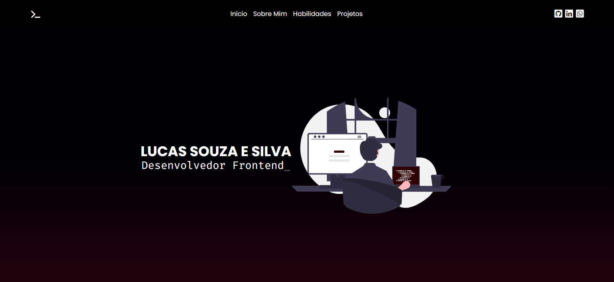
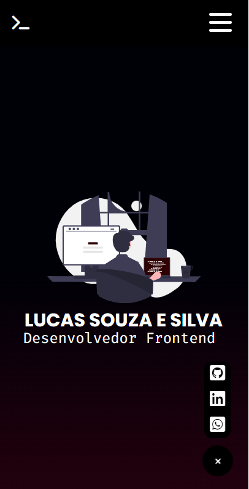
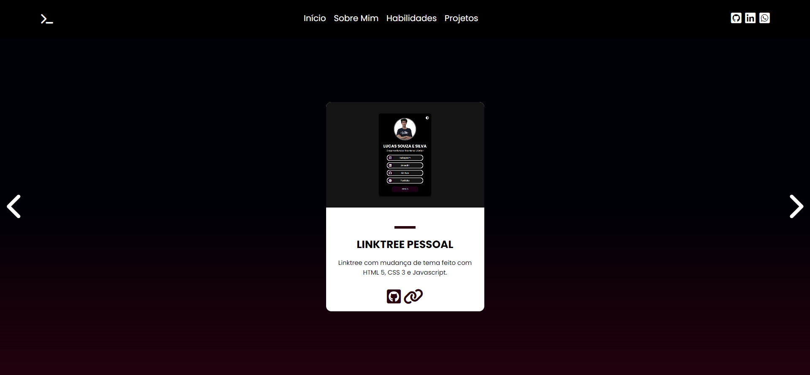
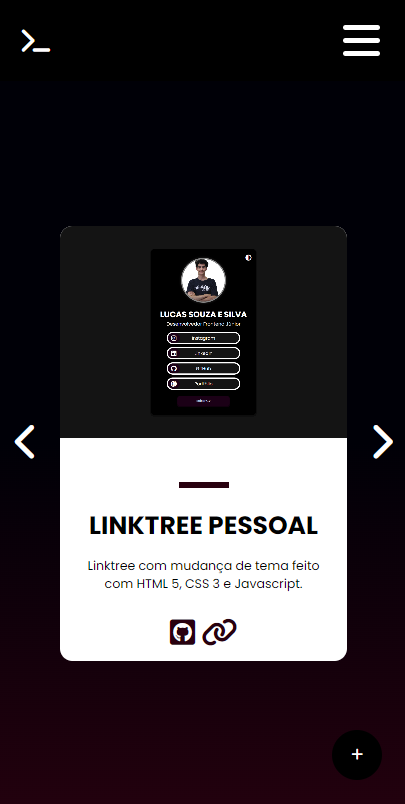

# Portfólio

## 📃Descrição
Olá turma, espero que todos estejam bem! Até que enfim concluí a primeira versão do meu portfólio pessoal. Esse projeto tem o intuito de mostrar um pouco sobre mim, minhas habilidades, objetivos e mostrar alguns dos meus projetos pessoais. Apliquei conceitos de HTML, CSS, Javascript. O layout é completamente responsivo.
  Como é um portfólio pessoal, tentei transmitir um pouco da minha personalidade nesse projeto, colocando cores, fontes e estilos que eu gosto.

## 🏋️‍♀️Dificuldades 
Minha maior dificuldade foi fazer o menu responsivo, principalmente na questão da animação. Porém, com um pouco mais de estudo consegui contornar esse problema e realizar a tarefa.

## 🧠Conclusão
Aprendi muito durante o desenvolvimento, principalmente na parte de CSS e Javascript. Gostei muito de realizá-lo, pois vai ser algo que vai me ajudar bastante nessa caminhada como desenvolvedor.     Mais pra frente quero implementar novas funcionalidades, como um formulário de contato, além de refazer o código usando React.

## 🪲Links
- GitHub Pages: https://lucashtml6.github.io/portfolio-v1/
- Repositório: https://github.com/lucashtml6/portfolio-v1

## 💻Tecnologias Utilizadas
- HTML5
- CSS3
- Javascript 

